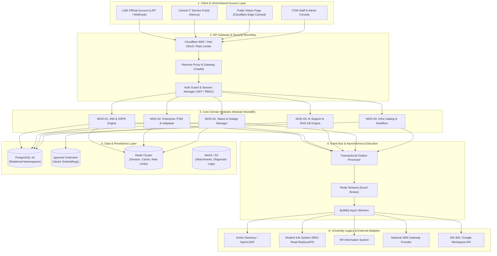
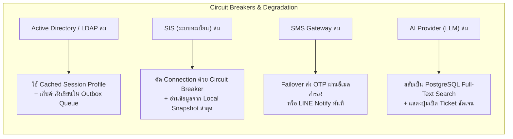

# System Architecture Blueprint
## Project: University Enterprise IT Service Platform (UniIT Hub)
**Document Version:** 1.0.0  
**Status:** Approved Architectural Standard  
**Pattern:** Event-Driven Modular Monolith  

---

## 1. Architectural Style & Monorepo Topology

UniIT Hub ถูกออกแบบภายใต้สถาปัตยกรรม **Event-Driven Modular Monolith** จัดการซอร์สโค้ดด้วย **Turborepo + pnpm Workspace** เพื่อให้ทีมพัฒนาที่ใช้เทคนิค **Vibe Coding** สามารถใช้ประโยชน์จาก End-to-End Type Safety ได้เต็มประสิทธิภาพ โดยไม่ต้องเผชิญกับความซับซ้อนของ Distributed Network เหมือน Microservices แยกคลัง

```
/
├── apps/
│   ├── web/                     # Next.js 14 (App Router) - Portal สำหรับนักศึกษา/อาจารย์ + Public Status Page
│   └── admin/                   # Next.js 14 - ITSM Console สำหรับช่างไอทีคณะและวิศวกรส่วนกลาง
├── packages/
│   ├── api-contracts/           # Shared Zod Schemas, tRPC Routers, and TypeScript Types
│   ├── database/                # Drizzle ORM Schema, Migrations, Seeds, pgvector definitions
│   ├── event-bus/               # Redis Streams Publisher/Subscriber Abstractions & Contracts
│   ├── ui/                      # Shared Tailwind + Radix UI Design System (shadcn-compatible)
│   └── config/                  # Shared ESLint, Prettier, TypeScript configurations
└── modules/
    ├── iam/                     # MOD-01: Identity, SSPR, OTP verification logic
    ├── itsm/                    # MOD-02: Ticket lifecycle, SLA calculation, Routing logic
    ├── ai-support/              # MOD-03: LangChain / RAG pipeline, Embedding retrieval
    ├── status-page/             # MOD-04: Synthetic probes, Outage suppression rules
    └── infra-catalog/           # MOD-05: Workflow state machine, E-approval magic links
```

---

## 2. Layered Architecture Diagram



---

## 3. Module Boundaries & Invariant Rules

เพื่อป้องกันไม่ให้โค้ดผูกติดกันจนเละ (Big Ball of Mud) กำหนดกฎเหล็กด้านสถาปัตยกรรมดังนี้:

1. **Database Schema Separation:** แต่ละโมดูลมี Logical Schema ใน PostgreSQL แยกกัน (`iam.*`, `itsm.*`, `kb.*`, `status.*`, `catalog.*`)
2. **ห้าม Cross-Module Direct Join:** โมดูล `itsm` ห้ามเขียนคำสั่ง SQL Join ข้ามไปยังตารางภายในของ `iam` โดยเด็ดขาด การเข้าถึงข้อมูลผู้ใช้ต้องทำผ่าน **Domain Service Method** หรืออ้างอิงผ่าน `user_id` เท่านั้น
3. **การสื่อสารแบบ Asynchronous ข้ามโมดูล:** หากเหตุการณ์ในโมดูลหนึ่งต้องการกระตุ้นการทำงานของอีกโมดูลหนึ่ง ต้องส่งผ่าน **Event Bus (Redis Streams)** เท่านั้น เช่น เมื่อเกิด Major Incident ใน `status-page` จะส่ง Event `incident.declared` ให้ `itsm` เปิดโหมด Ticket Suppression
4. **Adapter Pattern สำหรับระบบภายนอก:** การเรียกใช้งาน AD, LDAP, SIS, SMS ต้องผ่าน Interface Adapter ใน `/packages/adapters` ห้ามเขียน Direct Network Call กระจายอยู่ในโค้ดโมดูล

---

## 4. Event Catalog & Payload Specifications

ทุก Event ที่ส่งใน Redis Streams ต้องเป็น JSON ที่ Validate ด้วย Zod Schema จาก `/packages/api-contracts`:

| Event Name | Producer | Consumers | Business Purpose |
| :--- | :--- | :--- | :--- |
| `iam.password_reset.requested` | MOD-01 | Worker | สั่งส่งรหัส OTP ไปยัง SMS Gateway / อีเมลสำรอง |
| `iam.password.updated` | MOD-01 | Worker | สั่งซิงค์รหัสผ่านใหม่เข้าสู่ Active Directory / LDAP |
| `incident.status_changed` | MOD-04 | MOD-02, MOD-03, Worker | แจ้งเหตุระบบล่ม -> อัปเดต Prompt AI, เปิด Suppression ใน ITSM, Broadcast LINE |
| `ticket.created` | MOD-02 | Worker | คำนวณ SLA และส่งการแจ้งเตือนไปยังช่างประจำคณะ |
| `ticket.escalated` | MOD-02 | Worker | โอนเคสจาก L1 สู่ L2 พร้อมแจ้งเตือนหัวหน้างาน |
| `catalog.request.submitted` | MOD-05 | Worker | ส่งอีเมลพร้อม Magic Link ให้ผู้อนุมัติ (หัวหน้าภาค/รองคณบดี) |

---

## 5. Fallback & Resilience Strategies (Graceful Degradation)



1. **Active Directory / LDAP Unavailable:**
   * คำขออ่าน: ยืนยันตัวตนด้วย Local Shadow Database ใน PostgreSQL (ข้อมูล Snapshot รายวัน)
   * คำขอเขียน (SSPR): บันทึกลงตาราง `transactional_outbox` สถานะ `PENDING_AD_SYNC` เมื่อ AD กลับมาทำงาน Worker จะ Re-try ยิงคำสั่งโดยอัตโนมัติ
2. **SIS / HRIS Database Unavailable:**
   * ใช้ **Circuit Breaker (Threshold: 5 consecutive failures / 10s timeout)**
   * ตัดการต่อตรงทันที และใช้ Local Read Model ซึ่งเป็นข้อมูลแคชที่อัปเดตทุกเที่ยงคืน
3. **SMS Gateway Timeout:**
   * หาก API SMS ไม่ตอบสนองภายใน 8 วินาที ระบบจะสลับไปส่งรหัสผ่าน **Secondary Email** หรือ **LINE Messaging API** อัตโนมัติ พร้อมแจ้งบน UI
4. **Cloud LLM API Outage:**
   * ระบบแชตบอตจะตรวจจับ Fallback ภายใน 3 วินาที และสลับไปใช้ **PostgreSQL pg_trgm Full-Text Search** แนะนำหัวข้อ FAQ พร้อมแสดงปุ่ม "คุยกับเจ้าหน้าที่ (Create Ticket)" ทันที

---

## 6. Security, Authentication & PDPA Governance

* **Authentication:** NextAuth.js (Auth.js) เชื่อมโยงกับ University Central SSO (SAML 2.0 / OAuth2 / CAS) ควบคู่กับ JWT Session เก็บใน HttpOnly Secure Cookies
* **Authorization:** Role-Based Access Control (RBAC) 5 ระดับ:
  1. `STUDENT`
  2. `FACULTY_STAFF`
  3. `FACULTY_IT_L1`
  4. `CENTRAL_IT_L2_L3`
  5. `SUPER_ADMIN`
* **Data Encryption:**
  * In-Transit: Enforce TLS 1.3
  * At-Rest: AES-256 สำหรับคอลัมน์ข้อมูลส่วนบุคคล (เบอร์โทร, เลขบัตรประชาชน) ด้วย PGCrypto
* **Audit Trail (พ.ร.บ. คอมพิวเตอร์):**
  * บันทึก User ID, IP Address, Timestamp, Action Type, และ Resource ID ลงในตาราง `audit_logs`
  * บันทึกข้อมูลคงอยู่ไม่น้อยกว่า 90 วัน และป้องกันการแก้ไข/ลบ (Append-Only Table)
